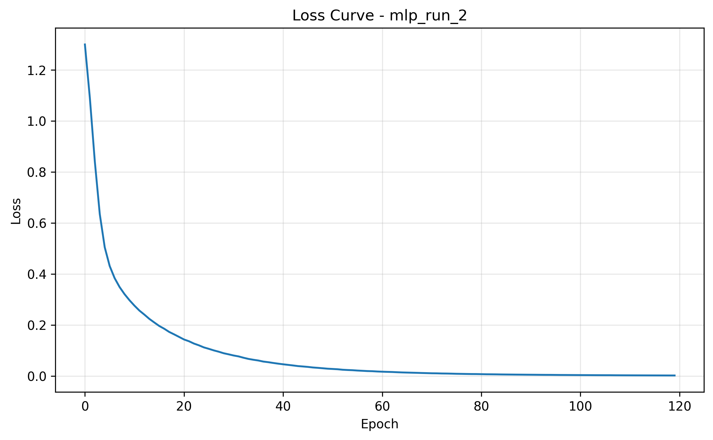

<div align="center">

# MLP Classification Study

**Three PyTorch multilayer perceptrons, one controlled tabular benchmark.**

`PyTorch` · `scikit-learn` · `Pandas` · `Matplotlib`

</div>

This coursework experiment trains three feed-forward neural networks on `dataset_039.csv` and compares their classification performance under different hidden-layer sizes, learning rates, batch sizes, and epoch budgets.

<p align="center">
  
</p>

## Method

- Convert arbitrary class labels to contiguous indices
- Stratified 80/20 train-test split with seed `42`
- Standardization fitted on training features only
- Two ReLU hidden layers and cross-entropy loss
- Adam optimization on CUDA when available, otherwise CPU
- Weighted precision, recall, F1, confusion matrix, and classification report
- Saved loss curves and model state dictionaries

## Configurations

| Run | Hidden layers | Learning rate | Batch | Epochs |
| --- | --- | ---: | ---: | ---: |
| `mlp_run_1` | 64 → 32 | 0.001 | 32 | 100 |
| `mlp_run_2` | 128 → 64 | 0.0005 | 32 | 120 |
| `mlp_run_3` | 64 → 16 | 0.005 | 64 | 80 |

The checked-in runs report test accuracy between 92.5% and 93.5%, with `mlp_run_2` performing best in that experiment. Reruns can vary because PyTorch's random seed is not fixed in the current script.

## Reproduce

```bash
python -m venv .venv
# Windows: .venv\Scripts\activate
# macOS/Linux: source .venv/bin/activate
python -m pip install numpy pandas torch matplotlib scikit-learn
python neural_network.py
```

Generated plots and weights are written to `mlp_results/`.

## License

No license is currently declared. All rights are reserved by default.
